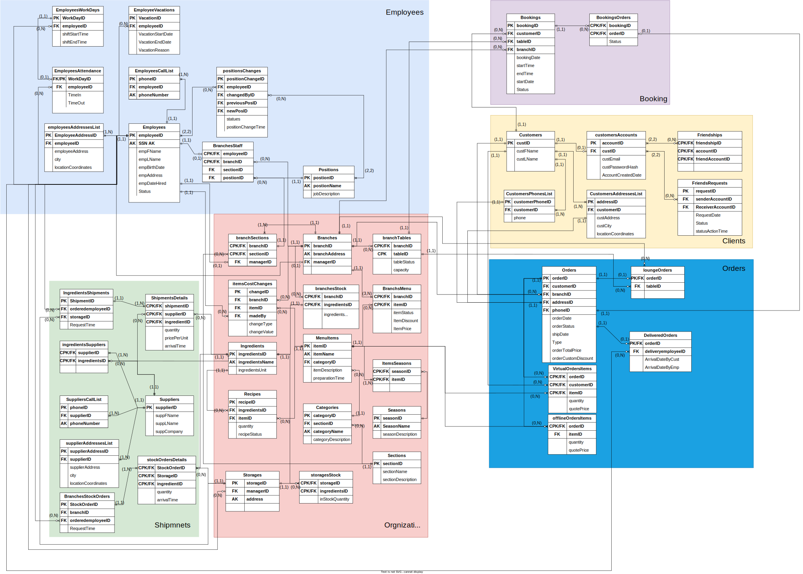

# 🧾 Alpha Restaurant SQL Schema

This project defines the complete SQL schema and data operation logic for the **Alpha Restaurant** database. It includes table definitions, data types, insert/update/query functions, and views.

The structure is modular, with each entity (e.g., branches, customers, employees) having its own dedicated SQL files for better maintainability.

---

## 📁 Queries Folder Overview

| File | Description |
|------|-------------|
| **`branches_get_functions.sql`** | Functions to retrieve data from the `branches` table. |
| **`branches_insert_functions.sql`** | Functions to insert new branch records. |
| **`branches_update_functions.sql`** | Functions to update existing branch data. |
| **`branches_views.sql`** | Views that summarize or format `branches` data for reporting or frontend consumption. |
| **`customers_get_functions.sql`** | Functions to query customer information. |
| **`customers_insert_functions.sql`** | Functions to insert new customers into the database. |
| **`customers_update_functions.sql`** | Update functions for modifying customer records. |
| **`customers_views.sql`** | Views related to customer data for streamlined access. |
| **`dataTypes.sql`** | Custom data types used across the schema, e.g., enums or composite types. |
| **`employees_get_functions.sql`** | Query functions for retrieving employee records. |
| **`employees_insert_functions.sql`** | Functions to add new employees to the system. |
| **`employees_update_functions.sql`** | SQL routines to update employee information. |
| **`employees_views.sql`** | Logical views that aggregate or reformat employee data. |
| **`orders_get_functions.sql`** | SQL functions to fetch order details and statuses. |
| **`orders_insert_functions.sql`** | Procedures to insert new orders. |
| **`orders_update_functions.sql`** | Update logic for order data, including status or item changes. |
| **`schemaQueries.sql`** | Table creation scripts that define the schema structure. |
| **`shipment_insert_functions.sql`** | Insert functions related to shipping or delivery data. |
| **`testQuery.sql`** | A sample query file for testing schema integrity and functionality. |
| **`views.sql`** | General-purpose views used across the application for simplifying complex queries. |

---

## 📊 LER Diagram

Below is the Logical Entity-Relationship Diagram (LERD) for the Alpha Restaurant schema:

---

